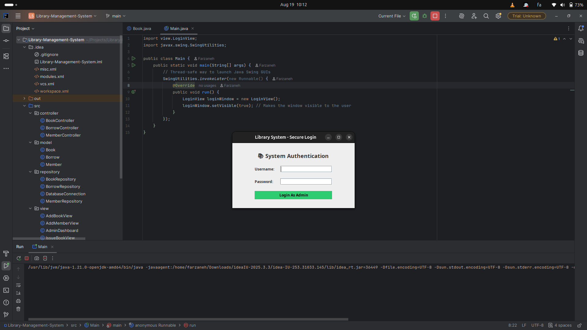
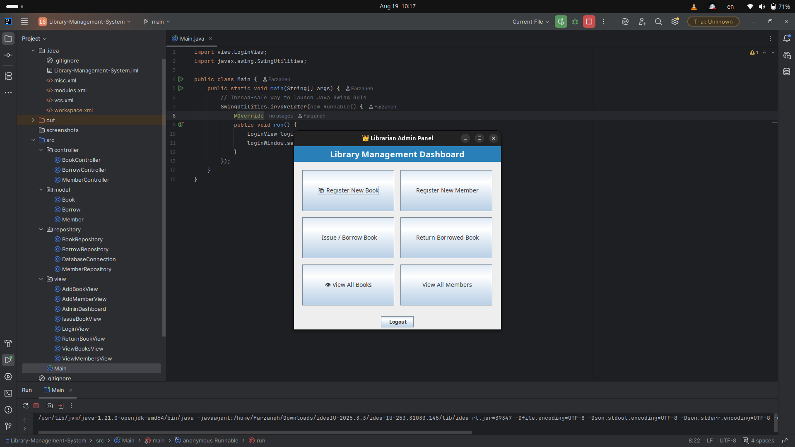
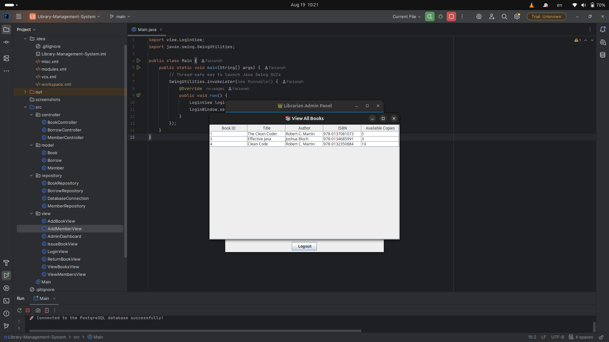
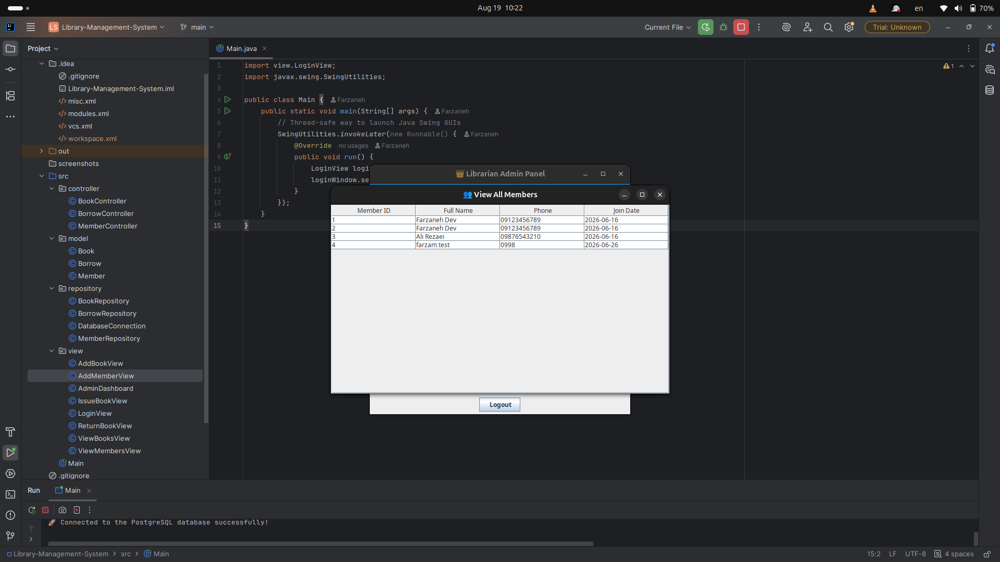
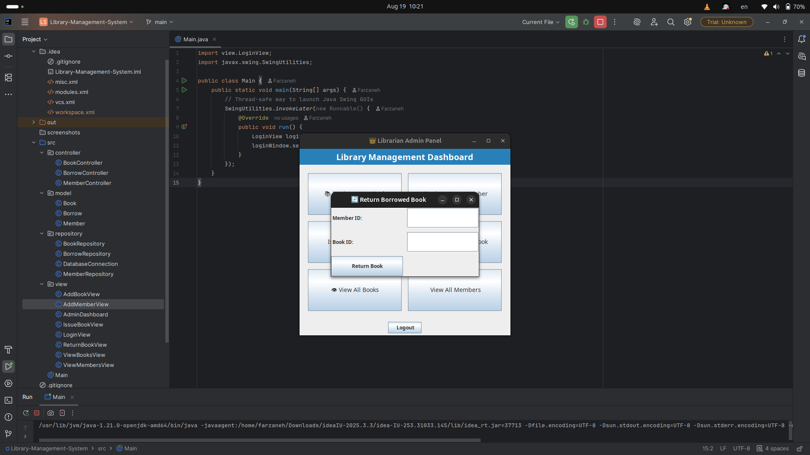
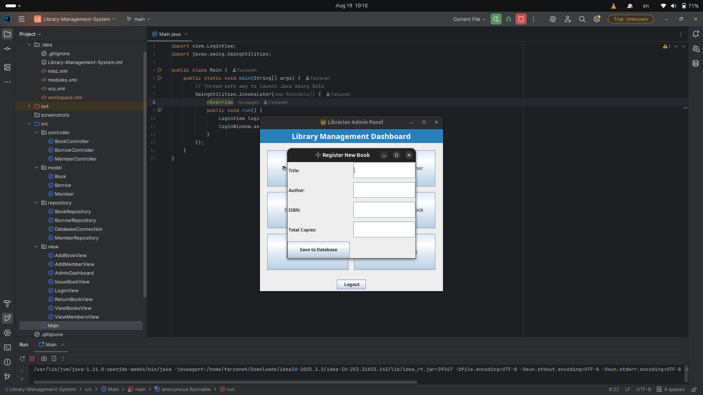
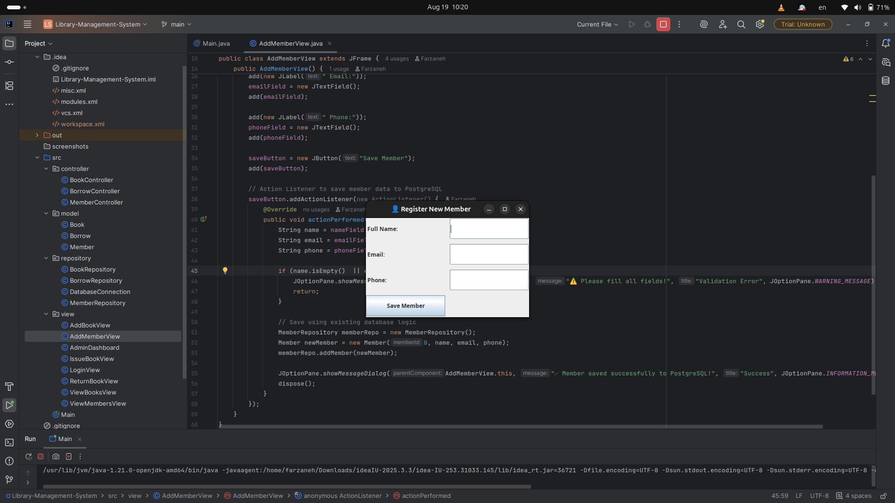

# 📚 Library Management System

A desktop-based Library Management System built with **Java Swing** and **PostgreSQL**, providing book and member management, borrowing and returning workflows, and database transaction handling.

## ✨ Features

* 🔐 User authentication
* 📚 Book management
* 👥 Member management
* 📖 Book borrowing and returning
* 🔄 Automatic available-copy management
* 📊 Dynamic book and member tables
* 🛡️ Database transaction handling with rollback on errors
* ⚠️ Input validation and exception handling

## 🏗️ Architecture

The application follows a layered structure inspired by the **MVC pattern**, separating the user interface, application flow, domain models, and database access.

```text
┌─────────────────────────┐
│       View Layer        │
│      Java Swing UI      │
└────────────┬────────────┘
             │
             ▼
┌─────────────────────────┐
│    Controller Layer     │
│    Application Flow     │
└────────────┬────────────┘
             │
             ▼
┌─────────────────────────┐
│    Repository Layer     │
│       JDBC / SQL        │
└────────────┬────────────┘
             │
             ▼
┌─────────────────────────┐
│       PostgreSQL        │
└─────────────────────────┘
```

## 📁 Project Structure

```text
src/
├── controller/
│   ├── BookController.java
│   ├── BorrowController.java
│   └── MemberController.java
│
├── model/
│   ├── Book.java
│   ├── Borrow.java
│   └── Member.java
│
├── repository/
│   ├── BookRepository.java
│   ├── BorrowRepository.java
│   ├── DatabaseConnection.java
│   └── MemberRepository.java
│
├── view/
│   ├── AddBookView.java
│   ├── AddMemberView.java
│   ├── AdminDashboard.java
│   ├── IssueBookView.java
│   ├── LoginView.java
│   ├── ReturnBookView.java
│   ├── ViewBooksView.java
│   └── ViewMembersView.java
│
└── Main.java
```

## 🛠️ Tech Stack

### Application

* **Java**
* **Java Swing / AWT**
* **JDBC**

### Database

* **PostgreSQL**
* **SQL**
* Relational Database Design

### Development

* **Git**
* **GitHub**
* **IntelliJ IDEA**

## 🧠 Skills Demonstrated

* Object-Oriented Programming (OOP)
* Java GUI Development
* JDBC & SQL
* PostgreSQL Database Management
* CRUD Operations
* Layered Architecture
* MVC-inspired Design
* Repository Pattern
* Database Transactions
* Exception Handling
* Relational Database Design
* Git & GitHub

## 🗄️ Database Design

The application uses PostgreSQL as its relational database.

### Main Entities

**Books**

* Book ID
* Title
* Author
* ISBN
* Available Copies

**Members**

* Member ID
* Full Name
* Phone
* Join Date

**Borrows**

* Borrow ID
* Member ID
* Book ID
* Borrow Date
* Return Date
* Status

### Relationships

```text
Members 1 ──────────── * Borrows * ──────────── 1 Books
```

The borrowing workflow connects members with books and keeps track of borrowing and return information.

## 📸 Screenshots

### 🔐 Authentication



### 🖥️ Dashboard



### 📚 Book & Member Management





### 📖 Borrowing Workflow




### ➕ Data Entry





## 🚀 How to Run

### Prerequisites

Make sure the following are installed:

* Java JDK
* PostgreSQL
* IntelliJ IDEA or another Java IDE

### 1. Clone the repository

```bash
git clone https://github.com/Farzaneh-Nasrabadii/Library-Management-System.git
cd Library-Management-System
```

### 2. Configure PostgreSQL

Create a PostgreSQL database and configure the database connection in:

```text
src/repository/DatabaseConnection.java
```

### 3. Create the database tables

Create the required tables for:

* Books
* Members
* Borrows

### 4. Run the application

Run:

```text
src/Main.java
```

The application will launch the login screen.

## 📄 License

This project is licensed under the **MIT License**.
